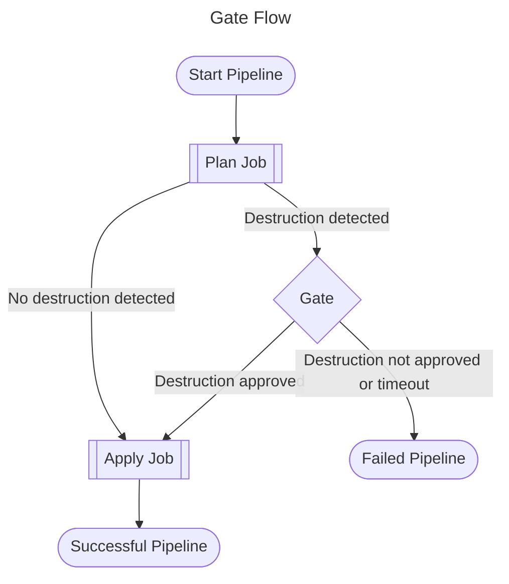

# How does this template work?

This template allows a pipeline to deploy resources via Terraform with a manual verification step, aka gate, for any resources planned to be destroyed. If the Terraform `plan` indicates that any resources will be destroyed then the gate will trigger. When no resources are flagged for destruction then the pipeline will automatically continue to Terraform `apply` without the gate. If the gate is triggered, then authorised users will need to approve in Azure DevOps in order to move on to the `apply` step. The gate will fail the pipeline if either rejected or times out.

The template is broken into three jobs:

- plan job
- gate (manual verification) job
- apply job

The flow works as follows

